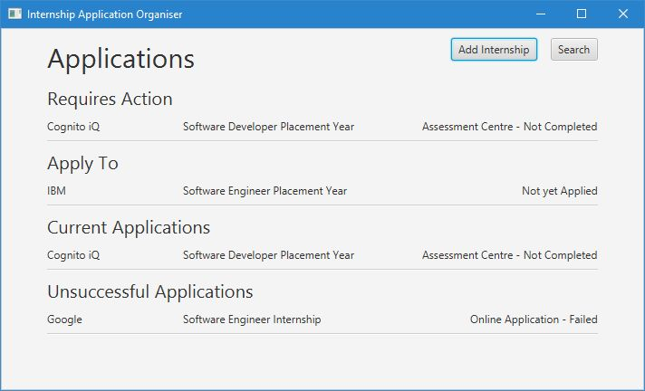

# ApplicationOrganiser
I started working on this desktop application during the time I was applying for placement year and summer internships. 

I found that I couldn't find any apps that allowed me to organise my applications the way I wanted in an easy way. Therefore I decided to work on a simple desktop application that allowed me to do just that.

I was able to then share my desktop application with my friends who were also applying for internships and placement years, and they found it to be very useful and helped them to keep track of all of the applications they were making.

### Screenshot

